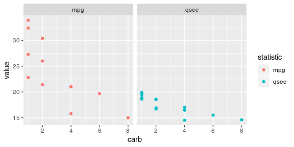

Template for analysis in R
================
rasi
22 September, 2018

-   [Introduction](#introduction)
-   [Import libraries](#import-libraries)
-   [Import data](#import-data)
-   [Transform data](#transform-data)
-   [Plot data](#plot-data)

Introduction
------------

-   This is an example outline of how we will analyze data inside RStudio.
-   Use the `Run` followed by `Run All` button in the tool bar above to view the results of running this script by scrolling below.

Import libraries
----------------

``` r
# standard analysis and plotting functions, includes dplyr, ggplot2 
library(tidyverse)
```

Import data
-----------

``` r
# data <- read_csv("https://github.com/tidyverse/readr/raw/master/inst/extdata/mtcars.csv")
data <- mtcars
```

Transform data
--------------

``` r
processed_data <- data %>% 
  filter(am == 1) %>%
  select(mpg, qsec, carb)

processed_data 
```

    ##     mpg  qsec carb
    ## 1  21.0 16.46    4
    ## 2  21.0 17.02    4
    ## 3  22.8 18.61    1
    ## 4  32.4 19.47    1
    ## 5  30.4 18.52    2
    ## 6  33.9 19.90    1
    ## 7  27.3 18.90    1
    ## 8  26.0 16.70    2
    ## 9  30.4 16.90    2
    ## 10 15.8 14.50    4
    ## 11 19.7 15.50    6
    ## 12 15.0 14.60    8
    ## 13 21.4 18.60    2

Plot data
---------

``` r
processed_data %>% 
  gather(statistic, value, -carb) %>% 
  ggplot(aes(x = carb, y = value, color = statistic)) +
  facet_wrap(~ statistic, ncol = 2) +
  geom_jitter(width = 0)
```


